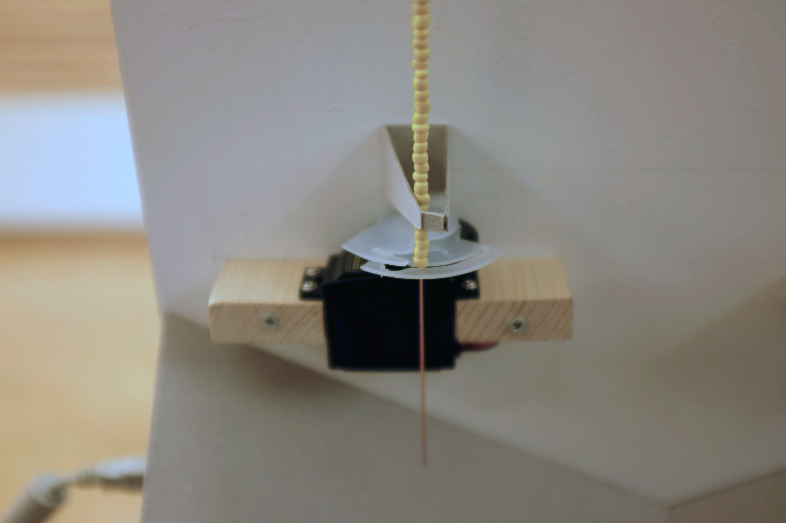

# Twitter Polling

This is a project I made with some friends during a workshop at the Ensci.

The workshop topic was data visualisation, so we decided to give it a spin and made.. A physical twitter popularity polling. 

(click for video)

The concept is very simple: you choose two words, and for the next minute, every time someone mentions one of the words, a coloured bead will fall into the test tube

The core of the program is a processing sketch, communicating through serial with an Arduino. What I like the most about this project is the bead dispenser mechanism, that we build using a laser cutter

In the end, we got quite a few coloured poll! A very fun and simple build. Of course, I am not sure it would work today, I think twitter does not allow access to the firehose anymore.

###Team

* Remy Aufort
* Azelle Dall'Armelina
* Matéo Lopez
* Benjamin Poilvé
* Margot Sparkes